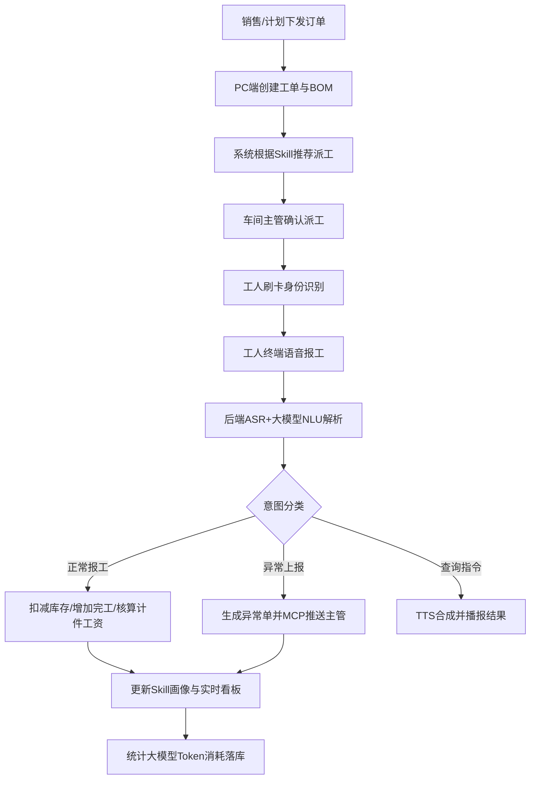

## 1. 产品概述
金造睿卡 · 轻量 MES 生产报工与库存管理系统，专为 ≤50 人的小型制造企业量身定制。
系统采用“车间端无屏语音交互、PC端全盘管控”的设计理念，通过金造睿卡智能终端进行语音报工与交互，结合后台 PC 端实现工单管理、智能派工、计件薪资、实时库存监控。并创新引入了员工/工序/部门的 Skill 经验体系、MCP 第三方集成网关以及基于大模型的语音语义解析与 Token 计费体系。

## 2. 核心功能

### 2.1 用户角色
| 角色 | 注册方式 | 核心权限 |
|------|----------|----------|
| 车间工人 | 后台分配录入 | 仅通过金造睿卡终端进行语音报工、异常上报、产量/工资查询 |
| 车间主管 | 系统分配 | PC端管理生产工单、基于Skill智能派工、查看生产进度、处理异常单 |
| 仓管员 | 系统分配 | PC端查看实时库存台账、出入库明细、安全库存预警 |
| 财务/老板 | 系统分配 | PC端查看计件工资报表、Skill能力模型图、Token消耗与计费图表、大模型看板问答 |

### 2.2 功能模块
1. **终端交互模块**：语音识别(ASR)与大模型语义解析(NLU)、自动TTS语音播报。
2. **计件报工模块**：按工序+Skill计价、合格/报废数据记录、自动核算工资、异常自动生成与推送。
3. **生产管理模块**：BOM绑定与工单创建、基于Skill智能推荐派工、工序流转与实时看板。
4. **库存管理模块**：出入库台账、安全库存预警、基于单据驱动的库存流转。
5. **Skill 经验体系**：员工/工序/部门的能力画像(雷达图)、经验模型分析与智能优化建议。
6. **集成与大模型模块**：MCP多系统集成网关配置、自然语言大屏问答、Token消耗计费与预估。

### 2.3 页面明细 (PC端)
| 页面名称 | 模块名称 | 功能描述 |
|----------|----------|----------|
| 首页看板 | 综合数据大屏 | 展示今日产量、活跃异常、实时动态、以及支持自然语言的老板/主管问答区 |
| 工单管理 | 生产计划 | 创建工单、绑定BOM物料、分配生产计划量与状态追踪 |
| 派工与报工 | 生产中枢 | 基于Skill模型智能推荐派工，查看车间工人实时报工与计件工资明细，处理异常单 |
| 库存管理 | WMS中心 | 实时库存台账列表、出入库流水单据、安全库存红线预警 |
| Skill中心 | 经验模型图谱 | 员工技能雷达图、各工序/部门的Skill画像、大模型生成的培训优化建议 |
| 系统设置 | 集成与计费 | MCP网关映射配置、接口监控、计件单价设置、Token消耗统计报表与计费预估 |

## 3. 核心流程
车间端无屏语音报工与PC端闭环管理流程。

## 4. 用户界面设计

### 4.1 设计风格
- **主色调与辅助色**：采用工业科技风，主色调选用深邃蓝 (Deep Tech Blue) 搭配高亮荧光青 (Neon Cyan) 强调核心数据，辅助色为稳重的深灰与白色。
- **组件风格**：卡片式布局 (Card-based)，微圆角 (border-radius: 8px) 以体现现代感，阴影运用以区分层级，按钮采用微渐变与点击反馈。
- **字体**：标题采用醒目的现代无衬线字体 (如 Inter 或 Roboto)，数字显示采用等宽字体 (Monospace) 凸显工业数据精准感。
- **图表与动画**：图表采用平滑渲染的 ECharts，数字跳动动画增加实时感，页面切换过渡柔和。
- **图标与细节**：使用工业或现代化线条图标 (如 Lucide/Heroicons)，确保界面整洁且信息密度适中。

### 4.2 页面设计概览
| 页面名称 | 模块名称 | UI元素设计 |
|----------|----------|------------|
| 首页看板 | 数据总览 | 深色背景大屏卡片，荧光数字跳动，雷达图、折线图结合，包含大模型AI问答对话框 |
| 工单与派工 | 列表与详情 | 抽屉式交互查看工单详情，Skill推荐派工时带金色高亮徽章提示，报工流水采用时间轴形式 |
| 库存管理 | 台账卡片 | 列表配合状态指示灯（库存正常为绿点，安全预警为红点闪烁） |
| 系统与计费 | 配置表单与统计 | 清爽明亮的表单页，Token消耗曲线平滑渐变，清晰的费用预估卡片 |

### 4.3 响应式要求
PC管理端优先设计 (Desktop-first)，适应主流 1080p 及以上宽屏显示，主要通过侧边导航栏与弹性布局自适应屏幕宽度。针对车间平板（若有）做触控交互优化。车间工人端仅使用语音终端，无屏幕界面。