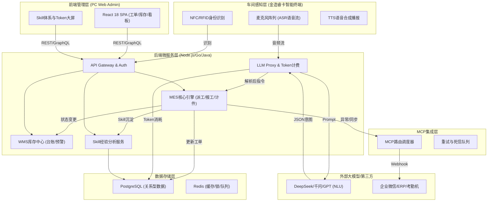
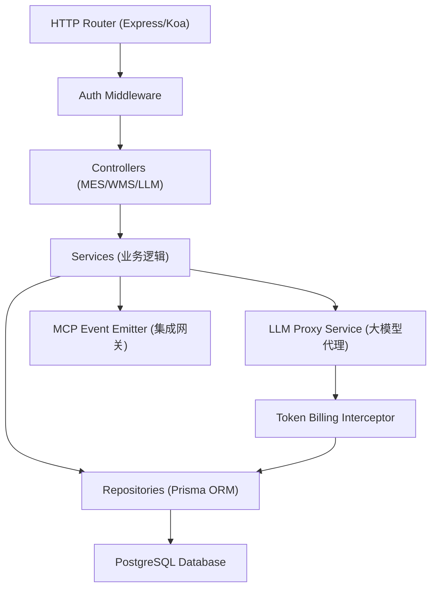
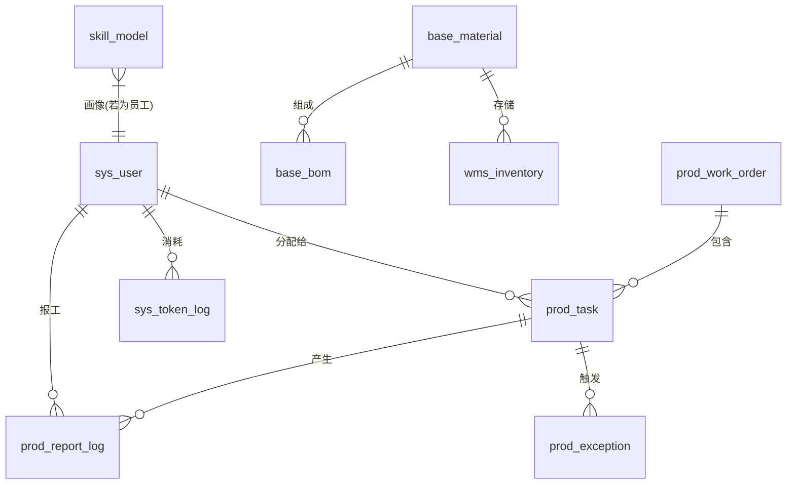

## 1. 架构设计


## 2. 技术栈说明
- **前端框架**：React@18 + Vite + TypeScript
- **状态管理**：Zustand / React Query
- **样式方案**：Tailwind CSS v3 + Radix UI / shadcn-ui + Framer Motion (动画)
- **图表渲染**：Recharts / ECharts
- **初始化工具**：Vite CLI
- **后端预设**：Node.js (Express/NestJS) 结合 PostgreSQL (Prisma ORM)

## 3. 路由定义 (前端 PC Admin)
| 路由 | 用途 |
|------|------|
| `/` | 登录页 |
| `/dashboard` | 生产看板大屏，AI问答区 |
| `/work-orders` | 生产工单管理，BOM列表 |
| `/dispatch` | 派工任务分配，Skill智能推荐 |
| `/inventory` | 实时库存台账，安全预警 |
| `/skill-center` | 员工/工序/部门Skill画像与分析 |
| `/billing` | Token消耗统计，计费报表 |
| `/settings` | 系统设置，MCP集成网关配置 |

## 4. API 接口定义 (核心)
```typescript
// 1. 终端语音指令报工 (Terminal -> Backend)
interface VoiceCommandRequest {
  card_id: string;
  audio_base64: string;
  timestamp: number;
}
interface VoiceCommandResponse {
  code: number;
  tts_text: string;
  action_status: 'success' | 'error';
  intent_parsed?: any;
}

// 2. 派工推荐 (Backend -> Frontend)
interface DispatchRecommendation {
  process_name: string;
  recommended_user_id: string;
  recommended_user_name: string;
  match_reason: string;
  skill_level: number;
}

// 3. Token用量查询
interface TokenUsageReport {
  user_id: string;
  feature_module: string;
  prompt_tokens: number;
  completion_tokens: number;
  total_cost: number;
  date: string;
}
```

## 5. 服务端架构图


## 6. 数据模型设计
### 6.1 数据模型定义


### 6.2 核心 DDL 示例
```sql
-- 用户表
CREATE TABLE sys_user (
    id UUID PRIMARY KEY DEFAULT gen_random_uuid(),
    name VARCHAR(50) NOT NULL,
    card_id VARCHAR(50) UNIQUE NOT NULL,
    role VARCHAR(20) NOT NULL,
    status VARCHAR(20) DEFAULT 'active'
);

-- 工单表
CREATE TABLE prod_work_order (
    id UUID PRIMARY KEY DEFAULT gen_random_uuid(),
    order_no VARCHAR(50) UNIQUE NOT NULL,
    product_id UUID NOT NULL,
    plan_qty INT NOT NULL,
    status VARCHAR(20) DEFAULT 'pending'
);

-- Token计费表
CREATE TABLE sys_token_log (
    id UUID PRIMARY KEY DEFAULT gen_random_uuid(),
    user_id UUID REFERENCES sys_user(id),
    feature_module VARCHAR(50) NOT NULL,
    prompt_tokens INT NOT NULL,
    completion_tokens INT NOT NULL,
    total_cost DECIMAL(10, 4) NOT NULL,
    created_at TIMESTAMP DEFAULT CURRENT_TIMESTAMP
);
```