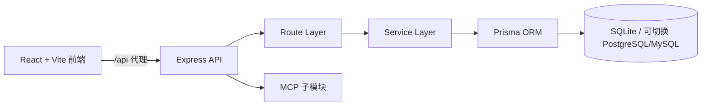

<div align="center">
  
  <h1>AIMES · 智能制造执行系统</h1>
  <p>面向生产现场的数字化协同平台，覆盖工单、报工、库存、派工、技能与计件结算闭环。</p>
</div>

<p align="center">
  
  
  
  
  
</p>

<span style="color:red">**⚠️ 当前 GitHub 发布为官方维护版本，其他平台的转载或二次分发内容请注意甄别风险。**</span>
## 答疑、交流路径
本星球以“咨询 + 答疑”为核心服务，围绕金造睿卡硬件、Agent 系统与 AI 定制落地，提供问题解答、方案评估与架构建议。适合正在推进数字化/智能化项目的企业负责人、产品经理与技术团队，帮助你少踩坑、快决策、稳落地。

<p align="center">

  

</p>
## 目录

- [项目定位](#项目定位)
- [核心能力](#核心能力)
- [架构设计](#架构设计)
- [技术栈](#技术栈)
- [快速开始](#快速开始)
- [运行脚本](#运行脚本)
- [目录结构](#目录结构)
- [API 示例](#api-示例)
- [数据模型](#数据模型)
- [部署建议](#部署建议)
- [贡献指南](#贡献指南)
- [版本发布](#版本发布)
- [路线图](#路线图)
- [相关文档](#相关文档)
- [License](#license)

## 项目定位

AIMES 面向离散制造/食品加工等场景，强调“从现场数据到经营决策”的闭环：

- 现场执行层：报工、库存、工单、派工
- 过程监控层：实时看板、异常预警、语音播报
- 经营核算层：技能模型、计件工资、奖惩规则

项目采用前后端同仓开发，支持本地一键启动，适合业务快速验证与中小团队持续迭代。

## 核心能力

- 智能看板：聚合订单、产量、品质、库存、设备、人员、安全信息。
- 工单管理：覆盖工单创建、计划拆分、执行状态跟踪。
- 报工明细：支持筛选、分页、统计、增删改查全流程。
- 库存管理：支持标准入库/出库单据、库存台账、流水追踪。
- 技能与计费：支持技能等级、工序计件、奖惩策略和结算域模型。
- MCP 扩展：独立模块维护，便于接入智能代理/工具链能力。

## 架构设计



### 模块边界

- `src/`：前端页面、组件、状态与交互逻辑。
- `api/routes/`：按业务域拆分接口（工单、报工、库存等）。
- `api/services/`：跨路由复用的业务服务。
- `prisma/schema.prisma`：统一数据模型与关系定义。
- `api/mcp/`：MCP 网关及工具扩展。

## 技术栈

### 前端

- React 18
- TypeScript
- Vite
- Tailwind CSS
- Framer Motion
- Zustand

### 后端

- Node.js
- Express
- TypeScript
- Prisma ORM
- SQLite（默认开发数据库）

## 快速开始

### 1. 环境要求

- Node.js `>= 20`
- npm `>= 10`

### 2. 安装依赖

```bash
npm install
```

### 3. 配置环境变量

根目录 `.env` 示例：

```env
DATABASE_URL="file:./dev.db"
API_PORT=3101
PORT=3101
```

### 4. 初始化数据库

```bash
npx prisma migrate dev
npx prisma generate
```

可选：写入演示数据

```bash
npx tsx api/seed.ts
```

### 5. 启动开发环境

```bash
npm run dev
```

默认访问地址：

- 前端：`http://localhost:5173`
- 后端：`http://localhost:3101`
- 健康检查：`http://localhost:3101/api/health`

## 运行脚本

```bash
# 前端开发
npm run client:dev

# 后端开发（nodemon + tsx）
npm run server:dev

# 前后端并行
npm run dev

# 类型检查
npm run check

# 代码规范检查
npm run lint

# 构建
npm run build

# 预览
npm run preview
```

## 目录结构

```text
aimes/
├─ api/
│  ├─ routes/              # API 路由层（按业务域拆分）
│  ├─ services/            # 业务服务层
│  ├─ mcp/                 # MCP 子模块
│  ├─ app.ts               # Express 应用装配
│  ├─ server.ts            # 本地服务入口
│  └─ seed.ts              # 种子数据脚本
├─ prisma/
│  └─ schema.prisma        # Prisma 数据模型
├─ src/
│  ├─ components/          # UI 组件
│  ├─ pages/               # 业务页面
│  ├─ hooks/               # 自定义 Hooks
│  └─ App.tsx              # 路由入口
├─ docs/                   # 业务/数据设计文档
├─ public/                 # 静态资源
├─ .env                    # 环境变量
└─ README.md
```

## API 示例

### 健康检查

```http
GET /api/health
```

```json
{
  "success": true,
  "message": "ok"
}
```

### 报工明细分页查询

```http
GET /api/v1/work-report-items?page=1&pageSize=20&shiftName=早班
```

```json
{
  "code": 200,
  "msg": "success",
  "data": {
    "page": 1,
    "pageSize": 20,
    "total": 128,
    "list": []
  }
}
```

### 标准响应约定

- 成功：`{ code: 200, msg: string, data: any }`
- 失败：`{ code: number, msg: string, data: null }`

## 数据模型

- 默认数据源为 SQLite，便于本地快速开发。
- 模型定义位于 `prisma/schema.prisma`。
- 关键实体包含 `User`、`WorkOrder`、`WorkReport`、`WorkReportItem`、`Inventory`、`StockIn`、`StockOut`、`WageSettlement` 等。
- MySQL 版历史结构可参考 `docs/mysql_schema.md` 与 `docs/mysql_schema.sql`。

## 部署建议

- 前端可部署至 Vercel/Netlify/Nginx 静态站点。
- 后端建议独立部署为 Node 服务（PM2 或容器化）。
- 生产建议使用 PostgreSQL 或 MySQL，并开启备份、连接池和日志审计。

## 贡献指南

### 分支策略

- `main`：稳定分支，仅合并通过验证的变更。
- `feature/*`：功能开发分支。
- `fix/*`：缺陷修复分支。

### 提交流程

1. Fork 并创建功能分支。
2. 完成功能后执行：

```bash
npm run check
npm run lint
```

3. 提交 Pull Request，说明变更背景、方案和验证结果。

### 代码约定

- 保持路由、服务、数据访问分层清晰。
- 避免在路由中堆叠复杂业务逻辑。
- 新接口优先沿用统一响应结构。

## 版本发布

建议采用 [Semantic Versioning](https://semver.org/lang/zh-CN/)：

- `MAJOR`：不兼容变更
- `MINOR`：向后兼容的新功能
- `PATCH`：向后兼容的问题修复

发布步骤建议：

1. 更新 `CHANGELOG.md`
2. 打标签并发布版本说明
3. 同步部署前后端与数据库迁移

## 路线图

- 完善认证鉴权与角色权限控制（RBAC）。
- 增加接口自动化测试与 E2E 回归用例。
- 支持多工厂/多产线租户化配置。
- 引入可观测性（Tracing + Metrics + Alert）。

## 相关文档

- `api/mcp/README.md`
- `docs/api_work_report.md`
- `docs/inventory_design.md`
- `docs/mysql_schema.md`

## License

当前仓库暂未声明许可证。建议补充 `MIT` 或 `Apache-2.0` 后对外发布。
